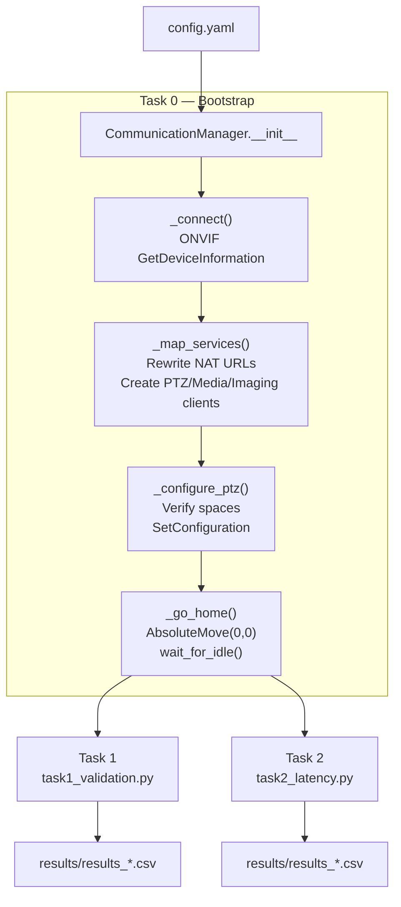
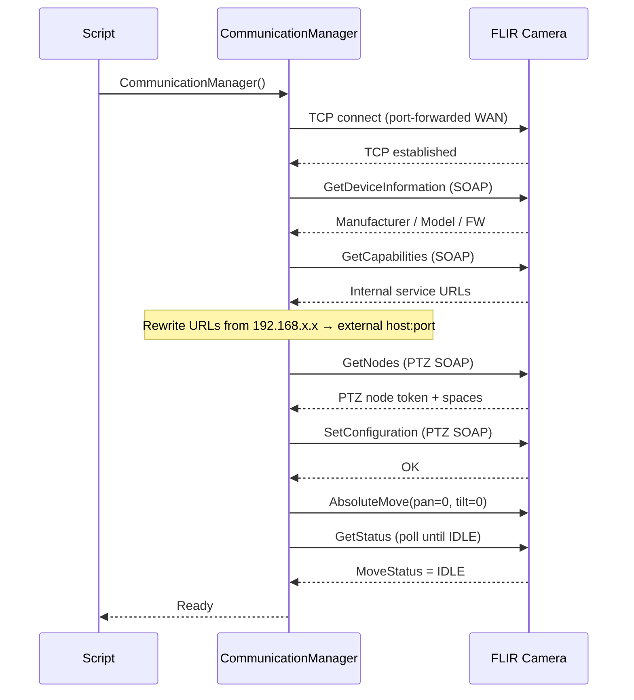
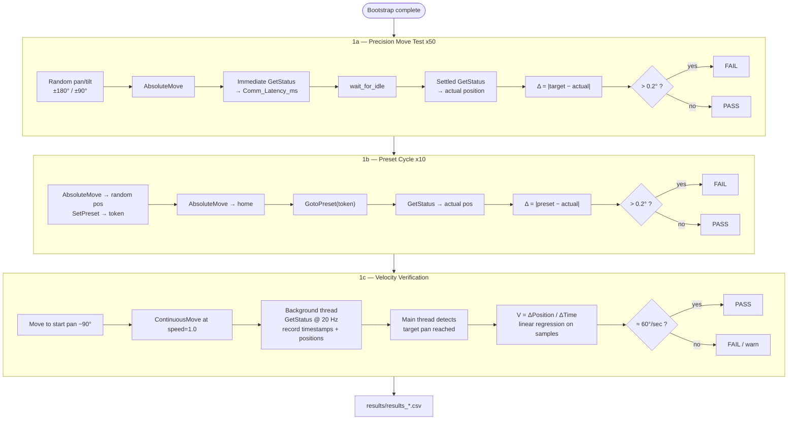
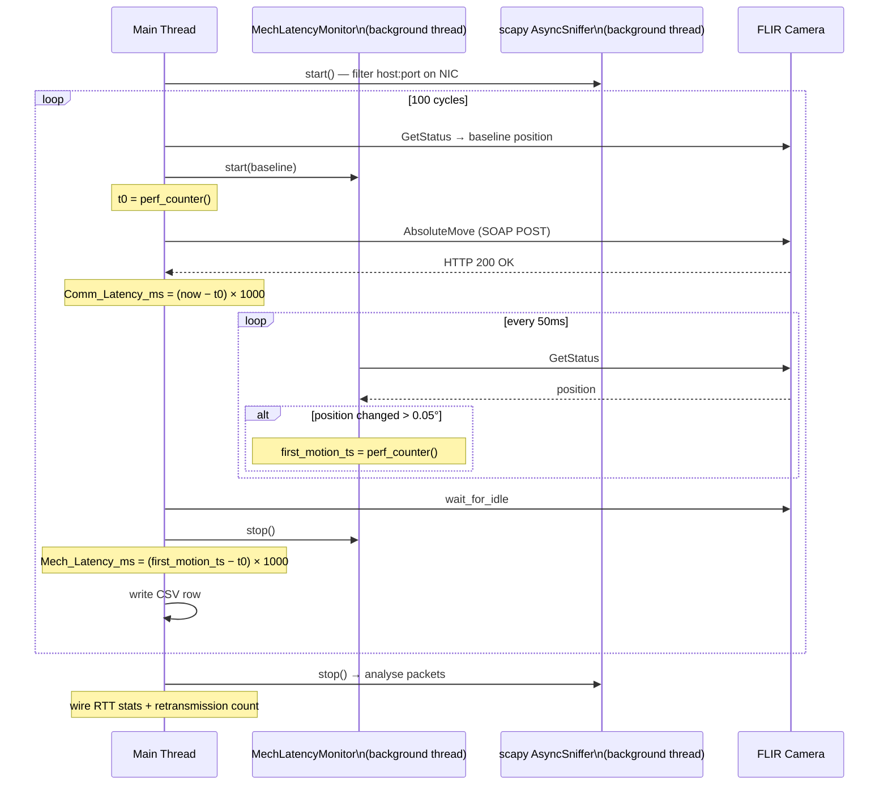
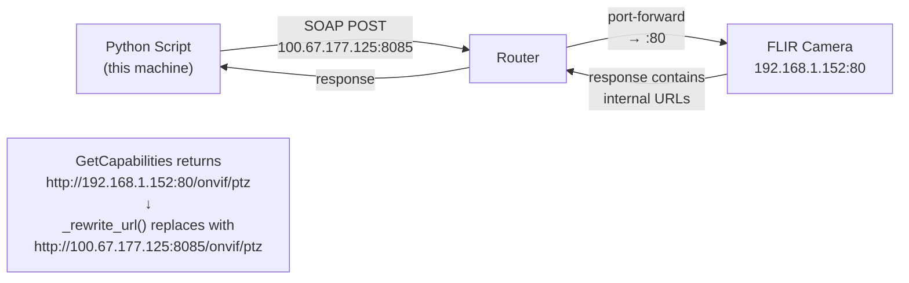

# FLIR PT-Series AI SR — Python Test Suite Plan

## Camera Hardware Context (from Datasheet)

| Parameter | Value |
|-----------|-------|
| Pan range | Continuous 360° |
| Pan speed | 0.1° to 60°/sec |
| Tilt range | +90° to −90° |
| Tilt speed | 0.1° to 30°/sec |
| Pointing accuracy | 0.2° |
| Security | Digest Authentication, TLS/HTTPS, IEEE 802.1x |

---

## Overall Suite Flow

---

## Task 0: Bootstrap & Configuration Layer (`comm_manager.py`)

Implement a `CommunicationManager` using `onvif-zeep` that:

1. **Discovery & Auth** — Performs WS-Discovery to find the camera (or direct IP for WAN access) and authenticates using Digest Authentication.
2. **Service Mapping** — Dynamically discovers the service URLs for DeviceManagement, PTZ, Imaging, and Analytics. Rewrites internal URLs to external host:port for NAT/port-forward traversal.
3. **PTZ Configuration**
   - Verifies the PTZ node is active.
   - Configures PTZ Spaces to use Absolute Pan/Tilt (Position) and Velocity (Speed).
   - Sets the Timeout parameter for continuous moves for safety during testing.
4. **Initial State Reset** — Moves the camera to Home position (Pan: 0, Tilt: 0) before any test begins.

---

## Task 1: Layer 1 — Command & Readback Validation (`task1_validation.py`)

### 1a. Precision Move Test
- Issue **50 `AbsoluteMove`** commands to random coordinates.
- Immediately follow each with a `GetStatus` call.
- Calculate the delta between Target and Reported position.
- Flag any result exceeding the **0.2° spec**.

### 1b. Preset Cycle
- Automate creation and deletion of **10 presets** to verify the 256-preset capacity.
- Move to each preset via `GotoPreset`, read back position, verify accuracy.

### 1c. Velocity Verification
- Execute a **180° pan at maximum 60°/sec** speed.
- Use a background thread to poll `GetStatus` coordinates.
- Calculate realized velocity: `V = ΔPosition / ΔTime`.

---

## Task 2: Layer 2 — Programmatic Control Latency (`task2_latency.py`)

### 2a. Application Latency (`Comm_Latency_ms`)
Time from calling `AbsoluteMove` to receiving HTTP 200 OK, measured with `time.perf_counter`.

### 2b. Mechanical Start Latency (`Mech_Latency_ms`)
Time from the Move command to the **first coordinate change** detected by a background `GetStatus` poll at 20 Hz.

### 2c. Reporting Jitter
Std-dev of `Comm_Latency_ms` over all cycles — identifies network or firmware bottlenecks.

### 2d. Wire-Level Packet Analysis (scapy)
- `AsyncSniffer` on the outbound NIC, filtered to camera host and port.
- Cross-validates Python-layer timing against wire timestamps.
- Detects TCP retransmissions.
- Reports min/max/mean RTT from the packet trace.
- **Requires `sudo`** (raw socket privileges).

---

## NAT / Port-Forward Traversal

---

## Requirements

- Python 3.10+
- No GUI — `scapy` for packet analysis
- Output to CSV: `Command_Type`, `Target_Pos`, `Actual_Pos`, `Delta_Pos`, `Comm_Latency_ms`, `Mech_Latency_ms`, `Pass_Fail`, `Notes`
- Robust error handling for ONVIF Faults (e.g., moving while already in motion)

## Key Libraries

| Library | Purpose |
|---------|---------|
| `onvif-zeep` | ONVIF SOAP communication |
| `scapy` | Packet capture and analysis |
| `pyyaml` | Configuration file |
| `numpy` | Statistics (std-dev, percentiles) |

## Configuration (`config.yaml`)

All tunable parameters in one file:
- Camera host/port/credentials
- PTZ speed limits and accuracy threshold
- Test counts (precision moves, presets)
- Timeouts (connect, soap, move, home)
- scapy interface name
- Latency cycle count and poll rate
